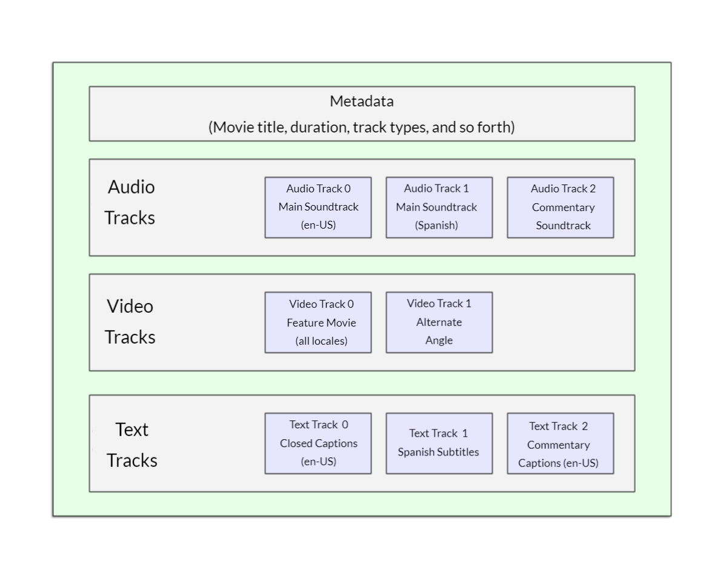

# Usando vários formatos de origem para melhorar a compatibilidade

Há um problema com o exemplo acima, que você já deve ter notado se tentou acessar o link ao vivo acima com um navegador mais antigo como o Internet Explorer ou até mesmo uma versão mais antiga do Safari. O vídeo não será reproduzido porque navegadores diferentes suportam formatos de vídeo (e áudio) diferentes. Felizmente, há coisas que você pode fazer para ajudar a evitar que isso seja um problema.

## Conteúdo de um arquivo de mídia

Primeiro, vamos passar rapidamente pela terminologia. Formatos como MP3, MP4 e WebM são chamados de formatos de contêiner . Eles definem uma estrutura na qual as faixas de áudio e/ou vídeo que compõem a mídia são armazenadas, juntamente com metadados que descrevem a mídia, quais codecs são usados ​​para codificar seus canais e assim por diante.

Um arquivo WebM contendo um filme que tem uma faixa de vídeo principal e uma faixa de ângulo alternativo, além de áudio para inglês e espanhol, além de áudio para uma faixa de comentário em inglês, pode ser conceituado conforme mostrado no diagrama abaixo. Também estão incluídas faixas de texto contendo legendas ocultas para o longa-metragem, legendas em espanhol para o filme e legendas em inglês para o comentário.

As faixas de áudio e vídeo dentro do contêiner contêm dados no formato apropriado para o codec usado para codificar essa mídia. Diferentes formatos são usados ​​para faixas de áudio versus faixas de vídeo. Cada faixa de áudio é codificada usando um codec de áudio , enquanto as faixas de vídeo são codificadas usando (como você provavelmente adivinhou) um codec de vídeo. Como falamos antes, diferentes navegadores suportam diferentes formatos de vídeo e áudio e diferentes formatos de contêiner (como MP3, MP4 e WebM, que por sua vez podem conter diferentes tipos de vídeo e áudio).

Por exemplo:

 * Um contêiner WebM normalmente empacota áudio Vorbis ou Opus com vídeo VP8/VP9. Isso é suportado em todos os navegadores modernos, embora as versões mais antigas possam não funcionar.

 * Um contêiner MP4 geralmente empacota áudio AAC ou MP3 com vídeo H.264. Isso também é suportado em todos os navegadores modernos, bem como no Internet Explorer.

 * O contêiner Ogg tende a usar áudio Vorbis e vídeo Theora. Isso é melhor suportado no Firefox e no Chrome, mas basicamente foi substituído pelo formato WebM de melhor qualidade.

Existem alguns casos especiais. Por exemplo, para alguns tipos de áudio, os dados de um codec geralmente são armazenados sem um contêiner ou com um contêiner simplificado. Uma dessas instâncias é o codec FLAC, que é armazenado mais comumente em arquivos FLAC, que são apenas faixas FLAC brutas.

Outra situação é o arquivo MP3 sempre popular. Um "arquivo MP3" é na verdade uma faixa de áudio MPEG-1 Audio Layer III (MP3) armazenada em um contêiner MPEG ou MPEG-2. Isso é especialmente interessante, pois embora a maioria dos navegadores não suporte o uso de mídia MPEG nos elementos `<video>` e `<audio>`, eles ainda podem suportar MP3 devido à sua popularidade.

Um reprodutor de áudio tenderá a reproduzir uma faixa de áudio diretamente, por exemplo, um arquivo MP3 ou Ogg. Estes não precisam de recipientes.

### Suporte a arquivos de mídia em navegadores

Nota: Por que temos esse problema? Acontece que vários formatos populares, como MP3 e MP4/H.264, são excelentes, mas estão sobrecarregados por patentes; ou seja, há patentes que cobrem parte ou toda a tecnologia em que se baseiam. Nos Estados Unidos, as patentes cobriram o MP3 até 2017, e o H.264 é onerado por patentes até pelo menos 2027.

Por causa dessas patentes, os navegadores que desejam implementar suporte para esses codecs devem pagar taxas de licença geralmente enormes. Além disso, algumas pessoas preferem evitar software restrito e preferem usar apenas formatos abertos. Devido a essas razões legais e preferenciais, os desenvolvedores da Web precisam oferecer suporte a vários formatos para capturar todo o seu público.

Os codecs descritos na seção anterior existem para compactar vídeo e áudio em arquivos gerenciáveis, pois o áudio e o vídeo brutos são extremamente grandes. Cada navegador da web suporta uma variedade de codecs , como Vorbis ou H.264, que são usados ​​para converter o áudio e o vídeo compactados em dados binários e vice-versa. Cada codec oferece suas próprias vantagens e desvantagens, e cada contêiner também pode oferecer seus próprios recursos positivos e negativos, afetando suas decisões sobre qual usar.

As coisas se tornam um pouco mais complicadas porque não apenas cada navegador suporta um conjunto diferente de formatos de arquivo de contêiner, mas também suporta uma seleção diferente de codecs. Para maximizar a probabilidade de seu site ou aplicativo funcionar no navegador de um usuário, pode ser necessário fornecer cada arquivo de mídia que você usa em vários formatos. Se o seu site e o navegador do usuário não compartilharem um formato de mídia em comum, sua mídia não será reproduzida.

Devido às complexidades de garantir que a mídia do seu aplicativo seja visível em todas as combinações de navegadores, plataformas e dispositivos que você deseja alcançar, escolher a melhor combinação de codecs e contêiner pode ser uma tarefa complicada. Consulte Escolhendo o contêiner correto em Formatos de contêiner de mídia (tipos de arquivo) para obter ajuda na seleção do formato de arquivo de contêiner mais adequado às suas necessidades; da mesma forma, consulte Escolhendo um codec de vídeo no guia de codec de vídeo da Web e Escolhendo um codec de áudio no guia de codec de áudio da Web para obter ajuda na seleção dos primeiros codecs de mídia a serem usados ​​para seu conteúdo e seu público-alvo.

Uma coisa adicional a ter em mente: os navegadores móveis podem suportar formatos adicionais não suportados por seus equivalentes de desktop, assim como podem não suportar todos os mesmos formatos que a versão para desktop. Além disso, os navegadores de desktop e móveis podem ser projetados para descarregar o manuseio da reprodução de mídia (para todas as mídias ou apenas para tipos específicos que não podem ser manipulados internamente). Isso significa que o suporte de mídia depende parcialmente de qual software o usuário instalou.
